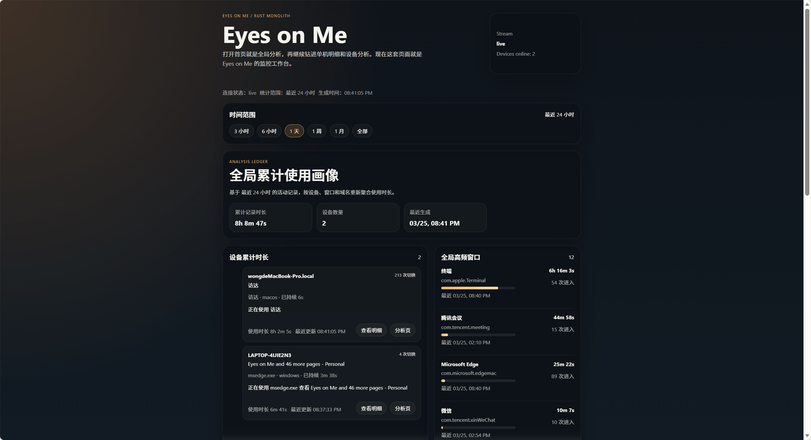
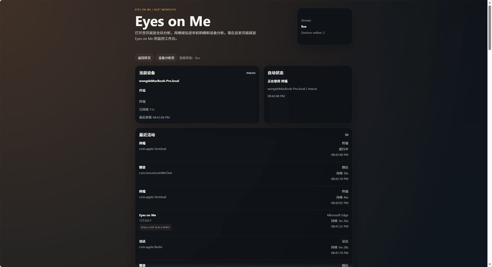
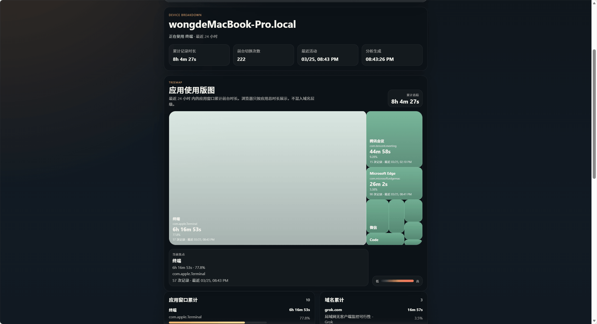

# 求视奸

[English](README_EN.md) | [中文](README.md)

## 1. 放弃懒惰，视奸自己

如果你也有这种感觉:

- 明明只是打开浏览器查点东西
- 结果一抬头，3 个小时没了
- 你以为自己一直在工作
- 实际上应用、窗口、网页、域名已经来回切了几十次

那 `Eyes on Me` 就是拿来把这件事扒出来的。

它会做三件事：

- 在桌面端采集当前前台应用、窗口标题、浏览器上下文
- 在服务端持续落库，形成设备级活动明细
- 在网页里把“我这段时间到底在干什么”直接展示出来

现在已经能看这些页面：

- `/` - 首页 / 全局分析页，看设备卡片、全局高频窗口、浏览器域名累计
- `/devices/:deviceId` - 单设备明细页，看最近活动切换
- `/devices/:deviceId/analysis` - 单设备分析页，看某台机器的使用画像

分析页已经支持这些时间范围：

- `3h` / `6h` / `today` / `1d` / `1w` / `1m` / `all`

一句话说完：

**这不是“做个监控 demo”。这是把你的电脑使用轨迹做成一套能看、能回放、能分析的 Rust 单体项目。**

## 2. 页面截图

截图都放在项目根目录的 [`image/`](image/) 里：

### 首页 / 全局分析



### 单设备明细



### 单设备分析



## 3. 怎么操作

### 使用

直接下载 release。第一次运行桌面采集端时，会默认生成一个 JSON 配置文件。

### 编译

下面所有命令，都在这个目录执行：

```bash
cd /Users/wong/Code/RustLang/Eyes_on_me
```

### 启动服务端

```bash
# 本机
./_scripts/run-server.sh

# 需要局域网 / 公网访问
./_scripts/run-server-public.sh
```

默认地址：

- `http://127.0.0.1:8787`
- 默认数据库文件：`DB/eyes-on-me.db`
- 服务端二进制默认内嵌前端页面资源，不依赖外部 `web/dist`

### 启动桌面采集端

```bash
./_scripts/run-agent.sh
```

如果要临时改服务端地址：

```bash
AGENT_SERVER_API_BASE_URL=http://127.0.0.1:8787 ./_scripts/run-agent.sh
```

### 打开页面

```text
http://127.0.0.1:8787/
```

首页里直接可以切：

- 最近 3 小时 / 6 小时 / 今天 / 1 天 / 1 周 / 1 月 / 全部

### 本地开发前端

```bash
./_scripts/run-web-dev.sh
```

前端开发地址：

- `http://127.0.0.1:5173`

Vite 已经把 `/api` 和 `/health` 代理到本地服务端 `http://127.0.0.1:8787`。

如果你想强制让服务端读取某个外部静态目录，也可以手动指定：

```bash
AMI_OKAY_WEB_DIST=/absolute/path/to/web/dist ./_scripts/run-server.sh
```

### 本机开发模式

现在不需要每次先打包再测。

直接开 3 个终端：

```bash
# 终端 1：服务端
./_scripts/run-server.sh

# 终端 2：桌面采集端
./_scripts/run-agent.sh

# 终端 3：前端开发服务器
./_scripts/run-web-dev.sh
```

然后打开：

- `http://127.0.0.1:5173`

如果只想看启动说明：

```bash
./_scripts/run-dev.sh
```

### 一键打包

```bash
./_scripts/package.sh
```

默认会输出到：

- `_dist/eyes-on-me-bundle-<host-target>`

当前打包行为：

- `client-server` 在构建时会把 `web/dist` 直接打进服务端二进制
- bundle 默认不再复制单独的 `web/dist` 目录
- 默认保留 bundle 目录里已经存在的 `DB/eyes-on-me.db`
- 默认不再把根目录 `DB/eyes-on-me.db` 强制复制进 bundle
- 如果你确实想把根目录数据库一起打进 bundle：

```bash
PACKAGE_COPY_DB=1 ./_scripts/package.sh
```

如果要指定平台：

```bash
TARGET_TRIPLE=x86_64-unknown-linux-gnu ./_scripts/package-target.sh
```

## Linux 采集的当前说明

> 都使用Linux了，还要什么界面(dog)

当前条件：

- 需要图形桌面环境
- 需要 `xprop`
- 更适合 X11 / XWayland

当前能力：

- 识别前台应用
- 识别窗口标题
- 浏览器场景会尽量从页面标题里反推域名
- 上报到服务端，并进入首页 / 设备分析页聚合

当前限制：

- 浏览器域名识别不如 macOS 完整
- 纯 Wayland 原生窗口场景下，兼容性还需要继续补
- 首次切到新版本时，如果目录里只有旧的 `amiokay.db`，服务端会自动迁到新的 `eyes-on-me.db`

## 4. 技术实现

### 服务端

服务端就是一个 Rust 进程，负责：

- 托管 Vue 静态页面
- 接收 `client-desktop` 上报
- 写入 SQLite
- 提供汇总 / 明细 / 分析接口
- 用 SSE 把最新快照推给浏览器

主要技术：

- `Rust`
- `axum`
- `tokio`
- `sqlx`
- `SQLite`
- `tower-http`
- `SSE`

主要接口：

- `GET /health`
- `GET /api/current`
- `GET /api/devices`
- `GET /api/devices/:deviceId`
- `GET /api/analysis?range=...`
- `GET /api/devices/:deviceId/analysis?range=...`
- `GET /api/stream`
- `POST /api/agent/activity`
- `POST /api/agent/status`

### 前端

前端是一个轻量 Vue 工作台，不做花哨中台，只做“看数据”这件事。

主要技术：

- `Vite`
- `Vue 3`
- `TypeScript`
- `vue-router`

当前前端能力：

- 首页 / 全局分析
- 单设备明细
- 单设备分析
- 时间范围切换
- SSE 自动刷新

### 桌面采集端

`client-desktop` 也是 Rust 写的。

平台实现：

- macOS: `NSWorkspace` + `System Events` + 低频 AppleScript 补浏览器页面
- Windows: 事件切换 + 定时补样
- Linux: `xprop` 轮询

采集流程：

1. 读取当前前台应用和窗口信息
2. 浏览器场景尽量补齐页面标题 / URL / 域名
3. 空闲 / 锁屏状态单独检测，不再继续累计活跃时长
4. 通过 HTTP POST 发给服务端
5. 服务端写库后，网页自动更新

当前采集模式：

- 实时前台切换会立即上报
- 长时间停留时，每 15 秒会补一个采样点
- 分析时会对连续时间做上限裁剪，避免旧稀疏数据把整天误算成一段

### 为什么这里用 SSE，不用 WebSocket

当前链路其实很简单：

- `client-desktop -> client-server` 用 HTTP POST
- `client-server -> browser` 用 SSE

原因也很简单：

- 页面主要是看数据，不是双向实时协作
- 浏览器只需要持续接收推送
- SSE 足够轻，也更容易维护

如果以后真要做控制指令、远程操作、双向通信，再上 WebSocket 也不晚。

## 灵感感谢

[https://github.com/meorionel/am-i-okay]([https://linux.do/](https://github.com/meorionel/am-i-okay))


## 社区

[LINUX DO](https://linux.do/)

## 许可证

GNU
