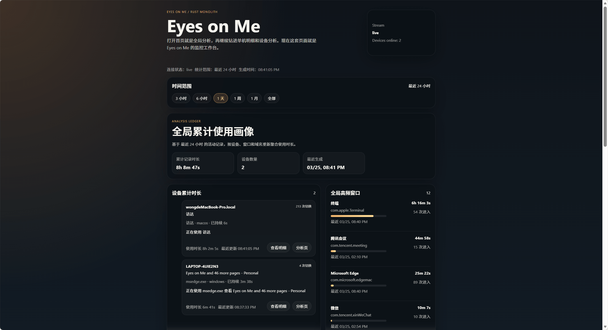
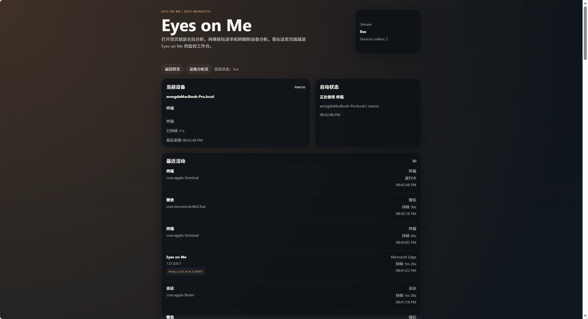
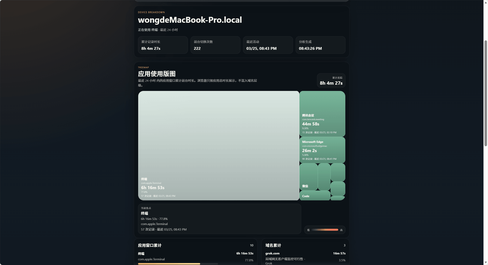

# 求视奸

[English](README_EN.md) | [中文](README.md)

## 1. 放弃懒惰，视奸自己

如果你也有这种感觉:

- 明明只是打开浏览器查点东西
- 结果一抬头，3 个小时没了
- 你以为自己一直在工作
- 实际上应用、窗口、网页、域名已经来回切了几十次

那 `Eyes on Me` 就是拿来把这件事扒出来的。

它会做三件事：

- 在桌面端采集当前前台应用、窗口标题、浏览器上下文
- 在服务端持续落库，形成设备级活动明细
- 在网页里把“我这段时间到底在干什么”直接展示出来

现在已经能看这些页面：

- `/` - 活动概览，看全局时长、24 小时分布、活动分类、应用、域名和设备状态
- `/devices/:deviceId` - 设备时间线，按任意日期、应用、域名、分类和时间段回放，查看连续工作片段与截图
- `/devices/:deviceId/analysis` - 设备分析，看小时分布、逐日趋势、应用版图和浏览器站点
- `/reports` - 活动日报，确定性生成、可选 AI 润色、区块偏好、历史查看、单日/范围导出和自动导出
- `/assistant` - 工作助手，支持自然语言时间范围、会话历史、流式响应、基础模板和可选 AI 增强
- `/memory` - 活动记忆，聚合活动、截图 OCR 与日报并进行语义或全文检索
- `/media` - 采集与媒体，查看 Agent 权限/隐私/积压、媒体容量、OCR 状态并执行删除或清理
- `/settings` - 回顾设置，配置历史即时生效的应用/域名分类、多段工作时段、日报区块及设置备份/恢复

分析页已经支持这些时间范围：

- `3h` / `6h` / `today` / `1d` / `1w` / `1m` / `all`

统计会区分工作时段、非工作时段、浏览器、空闲和锁屏时间。应用版图一级按应用聚合：Terminal、浏览器等应用即使有多个窗口或 Tab，也只占一个完整块；点击应用后再进入二级抽屉查看每个窗口 / Tab 的累计时长和进入次数。

设备页可以远程暂停/恢复采集；Agent 每 5 秒用一次轻量 HTTP 控制请求同步状态，窗口与 Tab 检测仍由原生系统事件触发，不增加 AppleScript 或高频外部进程。最后一次控制状态会在 Agent 本地持久化，断网和重启后继续遵守。

一句话说完：

**这不是“做个监控 demo”。这是把你的电脑使用轨迹做成一套能看、能回放、能分析的 Rust 单体项目。**

## 2. 页面截图

截图都放在项目根目录的 [`image/`](image/) 里：

### 首页 / 全局分析



### 单设备明细



### 单设备分析



## 3. 怎么操作

### 使用

直接下载 release。第一次运行桌面采集端时，会默认生成一个 JSON 配置文件。

### 编译

下面所有命令，都在这个目录执行：

```bash
cd /Users/wong/Code/RustLang/Eyes_on_me
```

### 启动服务端

```bash
# 本机
./_scripts/run-server.sh

# 需要局域网 / 公网访问
./_scripts/run-server-public.sh
```

默认地址：

- 默认监听：`127.0.0.1:8787`，只允许本机访问
- 本机访问：`http://127.0.0.1:8787`
- 默认数据库文件：`DB/eyes-on-me.db`
- 服务端二进制默认内嵌前端页面资源，不依赖外部 `web/dist`

服务端把所有可排序时间统一保存为固定毫秒精度的 UTC；“今天”、逐日统计和工作时段仍按服务端本地时区计算。升级后第一次启动会在 SQLite 事务内把旧的 RFC3339 时区写法规范化，并在 `eyes_on_me_schema_migrations` 留下版本记录。迁移不改变实际时刻；重要数据库升级前仍建议备份 `DB/eyes-on-me.db`。

Agent 上报接口使用 Bearer Token。开发环境默认值是 `dev-agent-token`；局域网或公网部署必须换成随机长 Token，并让服务端和采集端保持一致：

```bash
# 服务端，公网模式两个 Token 都至少 24 个字符
EYES_ON_ME_AGENT_API_TOKEN='replace-with-a-long-random-agent-token' \
EYES_ON_ME_DASHBOARD_TOKEN='replace-with-a-long-random-dashboard-token' \
./_scripts/run-server-public.sh

# 采集端
AGENT_API_TOKEN='replace-with-a-long-random-agent-token' \
AGENT_SERVER_API_BASE_URL='http://server-address:8787' \
./_scripts/run-agent.sh
```

`run-server-public.sh` 会明确监听 `0.0.0.0`，并强制校验 Agent Token 和 Dashboard Token。Dashboard 登录成功后使用 `HttpOnly`、`SameSite=Strict` Cookie；HTTPS 部署还应设置 `EYES_ON_ME_SECURE_COOKIE=1`。公网服务仍建议放在 VPN 或 HTTPS 反向代理后面。

### 启动桌面采集端

```bash
./_scripts/run-agent.sh
```

截图默认关闭。明确启用后，Agent 只在活跃状态的前台窗口切换时截图；空闲、锁屏、`anonymize` 和 `skip` 规则都不会产生截图。默认把当前窗口压缩成宽度不超过 1920 的 JPEG：

```bash
EYES_ON_ME_SCREENSHOTS=1 \
EYES_ON_ME_SCREENSHOT_COOLDOWN_SECS=30 \
./_scripts/run-agent.sh
```

Agent 会先把活动和已绑定的截图原子写入 `client-desktop.spool`，服务端不可达或 Agent 重启后继续发送，两个请求都成功才删除本地条目。默认队列上限 512MB，可在 JSON 的 `spool.max_bytes` 调整。

服务端默认调用 `tesseract` 做受限并发 OCR，原图保存在 `DB/media`，列表使用独立 JPEG 缩略图。相似画面会复用 OCR 结果；失败任务可在 `/media` 重试。默认保留 7 天且总量不超过 2GB：

```bash
EYES_ON_ME_MEDIA_RETENTION_DAYS=14 \
EYES_ON_ME_MEDIA_TOTAL_MAX_BYTES=4294967296 \
EYES_ON_ME_OCR_CONCURRENCY=1 \
EYES_ON_ME_OCR_LANGUAGE=eng+chi_sim \
./_scripts/run-server.sh
```

`EYES_ON_ME_OCR_COMMAND=off` 可关闭 OCR；`EYES_ON_ME_OCR_REDACT_TERMS=token,password` 会在入库和 FTS 前把包含指定词的 OCR 行替换为 `[redacted]`。

AI 日报润色和语义向量都是可选项；不配置时，日报继续使用确定性生成，记忆继续使用 SQLite 全文检索：

```bash
EYES_ON_ME_AI_BASE_URL='https://api.openai.com/v1' \
EYES_ON_ME_AI_API_KEY='your-api-key' \
EYES_ON_ME_AI_MODEL='your-chat-model' \
EYES_ON_ME_EMBEDDING_MODEL='your-embedding-model' \
./_scripts/run-server.sh
```

远程截图镜像是可选项，本地媒体仍是主存储。WebDAV 与 S3/MinIO 都支持失败状态、自动重试和删除同步；公网明文 HTTP 端点会被拒绝：

```bash
# WebDAV
EYES_ON_ME_REMOTE_PROVIDER=webdav \
EYES_ON_ME_WEBDAV_URL='https://dav.example.com/archive' \
EYES_ON_ME_WEBDAV_USERNAME='user' \
EYES_ON_ME_WEBDAV_PASSWORD='password' \
EYES_ON_ME_REMOTE_PREFIX='eyes-on-me' \
./_scripts/run-server.sh

# S3 / MinIO
EYES_ON_ME_REMOTE_PROVIDER=s3 \
EYES_ON_ME_S3_ENDPOINT='https://s3.example.com' \
EYES_ON_ME_S3_BUCKET='activity-archive' \
EYES_ON_ME_S3_REGION='us-east-1' \
EYES_ON_ME_S3_ACCESS_KEY='access-key' \
EYES_ON_ME_S3_SECRET_KEY='secret-key' \
./_scripts/run-server.sh
```

MCP 使用独立 Token，默认关闭。配置后把 `POST http://127.0.0.1:8787/mcp` 作为 HTTP JSON-RPC 端点，并发送 `Authorization: Bearer ...`：

```bash
EYES_ON_ME_INTEGRATION_TOKEN='replace-with-a-long-random-integration-token' ./_scripts/run-server.sh
```

工具包括当前上下文、时间线、连续工作片段、语义记忆、日报读取/生成和媒体状态；机器人或自动化程序通过同一 MCP 边界接入，不直接打开 SQLite。

如果要临时改服务端地址：

```bash
AGENT_SERVER_API_BASE_URL=http://127.0.0.1:8787 ./_scripts/run-agent.sh
```

### 打开页面

```text
http://127.0.0.1:8787/
```

首页里直接可以切：

- 最近 3 小时 / 6 小时 / 今天 / 1 天 / 1 周 / 1 月 / 全部

### 本地开发前端

```bash
./_scripts/run-web-dev.sh
```

前端开发地址：

- `http://127.0.0.1:5173`

Vite 已经把 `/api` 和 `/health` 代理到本地服务端 `http://127.0.0.1:8787`。

如果你想强制让服务端读取某个外部静态目录，也可以手动指定：

```bash
EYES_ON_ME_WEB_DIST=/absolute/path/to/web/dist ./_scripts/run-server.sh
```

### 本机开发模式

现在不需要每次先打包再测。

直接开 3 个终端：

```bash
# 终端 1：服务端
./_scripts/run-server.sh

# 终端 2：桌面采集端
./_scripts/run-agent.sh

# 终端 3：前端开发服务器
./_scripts/run-web-dev.sh
```

然后打开：

- `http://127.0.0.1:5173`

如果只想看启动说明：

```bash
./_scripts/run-dev.sh
```

### 一键打包

```bash
./_scripts/package.sh
```

### 完整验收

先统一构建，再运行隔离验收。脚本使用临时 SQLite、临时媒体目录和 `127.0.0.1:18787`，结束后自动清理，不修改正式数据：

```bash
cargo build --workspace
./_scripts/test-acceptance.sh
```

默认会输出到：

- `_dist/eyes-on-me-bundle-<host-target>`

当前打包行为：

- `client-server` 在构建时会把 `web/dist` 直接打进服务端二进制
- bundle 默认不再复制单独的 `web/dist` 目录
- 默认保留 bundle 目录里已经存在的 `DB/eyes-on-me.db`
- 默认不再把根目录 `DB/eyes-on-me.db` 强制复制进 bundle
- 如果你确实想把根目录数据库一起打进 bundle：

```bash
PACKAGE_COPY_DB=1 ./_scripts/package.sh
```

如果要指定平台：

```bash
TARGET_TRIPLE=x86_64-unknown-linux-gnu ./_scripts/package-target.sh
```

## Linux 采集的当前说明

> 都使用Linux了，还要什么界面(dog)

当前条件：

- 需要图形桌面环境
- 需要 `xprop`
- 更适合 X11 / XWayland

当前能力：

- 识别前台应用
- 识别窗口标题
- 浏览器场景会尽量从页面标题里反推域名
- 上报到服务端，并进入首页 / 设备分析页聚合

当前限制：

- 浏览器域名识别不如 macOS 完整
- 纯 Wayland 原生窗口场景下，兼容性还需要继续补
- 首次切到新版本时，如果目录里只有旧的 `amiokay.db`，服务端会自动迁到新的 `eyes-on-me.db`

## 4. 技术实现

### 服务端

服务端就是一个 Rust 进程，负责：

- 托管 Vue 静态页面
- 接收 `client-desktop` 上报
- 写入 SQLite
- 提供汇总 / 明细 / 分析接口
- 提供任意范围时间线、分页筛选、连续工作片段、待办线索和事务化批量删除
- 校验并保存原图/缩略图、相似图 OCR 复用、受限并发 OCR、留存/容量清理和细粒度删除
- 生成 / 编辑日报，维护可选向量化的活动记忆
- 管理历史即时生效的分类、多段工作时段、日报区块、会话助手和设置备份
- 可选镜像截图到 WebDAV 或 S3/MinIO，并提供独立 Token 的 MCP 接口
- 使用 Dashboard Cookie 保护查询、媒体、SSE、日报和记忆接口
- 用 SSE 把最新快照推给浏览器

主要技术：

- `Rust`
- `axum`
- `tokio`
- `sqlx`
- `SQLite`
- `tower-http`
- `SSE`

主要接口：

- `GET /health`
- `GET /api/current`
- `GET /api/devices`
- `GET /api/search/activities?q=...&deviceId=...`
- `GET /api/timeline?date=...&deviceId=...&app=...&domain=...&category=...&limit=...&offset=...`
- `GET /api/sessions?date=...&deviceId=...`
- `POST /api/activities/bulk-delete`
- `GET /api/devices/:deviceId`
- `GET /api/analysis?range=...`
- `GET /api/devices/:deviceId/analysis?range=...`
- `PUT /api/devices/:deviceId/recording`
- `GET /api/stream`
- `POST /api/auth/login`
- `POST /api/agent/screenshots/:eventId`
- `GET /api/devices/:deviceId/screenshots`
- `GET /api/screenshots/:screenshotId/thumbnail`
- `DELETE /api/screenshots/:screenshotId`
- `POST /api/screenshots/:screenshotId/ocr`
- `DELETE /api/activities/:eventId`
- `GET /api/media/status`
- `POST /api/media/cleanup`
- `GET /api/export/activities?format=csv|json`
- `GET|PUT /api/reports/:date`
- `GET /api/reports?start=...&end=...`
- `GET /api/reports/export?start=...&end=...`
- `POST /api/reports/:date/generate`
- `GET /api/memory`
- `POST /api/memory/reindex`
- `GET|PUT /api/settings/review`
- `GET /api/settings/review/export`
- `POST /api/settings/review/import`
- `GET /api/assistant/conversations`
- `POST /api/assistant/stream`
- `GET /api/media/remote`
- `POST /api/media/remote/retry`
- `POST /mcp`
- `POST /api/agent/activity`
- `POST /api/agent/status`

### 前端

前端是一个轻量 Vue 工作台，不做花哨中台，只做“看数据”这件事。

主要技术：

- `Vite`
- `Vue 3`
- `TypeScript`
- `vue-router`

当前前端能力：

- 响应式活动概览 / 设备时间线 / 设备分析
- 24 小时活动分布、分类占比、逐日趋势、应用与域名排行
- 应用矩形树图，以及窗口 / Tab 二级明细
- 设备活动全文搜索
- 任意日期时间线、组合筛选、分页、单条/日期/时间段/应用删除
- 远程暂停/恢复、连续工作片段和潜在待办
- 截图缩略图 / 查看器、OCR 搜索/重试、媒体管理和活动删除
- Dashboard 登录、日报历史/区块偏好/范围导出、活动记忆与流式工作助手
- 分类、多段工作时段、设置备份/恢复和远程镜像状态
- 多时间范围切换
- SSE 自动刷新

### 桌面采集端

`client-desktop` 也是 Rust 写的。

平台实现：

- macOS: `NSWorkspace` + `AXObserver` + Accessibility/CoreGraphics 原生补扫，运行时不使用 AppleScript
- Windows: 事件切换 + 定时补样
- Linux: `xprop` 轮询

采集流程：

1. 读取当前前台应用和窗口信息
2. 浏览器场景尽量补齐页面标题 / URL / 域名
3. 空闲 / 锁屏状态单独检测，不再继续累计活跃时长
4. 先执行 `record` / `anonymize` / `skip` 隐私决策
5. 活动与可选截图先写入磁盘 spool，再通过 HTTP POST 顺序上传
6. 服务端写库后，网页自动更新

当前采集模式：

- 实时前台切换会立即上报
- 长时间停留时，每 15 秒会补一个采样点
- 分析时会对连续时间做上限裁剪，避免旧稀疏数据把整天误算成一段

### 为什么这里用 SSE，不用 WebSocket

当前链路其实很简单：

- `client-desktop -> client-server` 用 HTTP POST
- `client-server -> browser` 用 SSE

原因也很简单：

- 页面主要是看数据，不是双向实时协作
- 浏览器只需要持续接收推送
- SSE 足够轻，也更容易维护

如果以后真要做控制指令、远程操作、双向通信，再上 WebSocket 也不晚。

## 灵感感谢

- [Work Review](https://github.com/wm94i/Work-Review) - 统计、时间线、日报和个人工作回顾思路
- [am-i-okay](https://github.com/meorionel/am-i-okay)

`Work Review` 是本地桌面应用。本项目没有复制其 Tauri 本机路径实现，而是完成了适合多设备服务端的字节上传、媒体存储、异步 OCR、日报和活动记忆链路。迁移决策见 [架构与 Work Review 迁移评估](outputs/ARCHITECTURE_AND_WORK_REVIEW_MIGRATION.md) 与 [截图、日报、记忆实现规范](outputs/SCREENSHOT_REPORT_MEMORY_SPEC.md)。


## 社区

[LINUX DO](https://linux.do/)

## 许可证

本项目不再使用 GPL。

当前采用的是仓库根目录中的自定义许可证：

- 仅允许自然人以个人、非商用目的使用、复制、修改和分发
- 只要你修改、分发，或把它部署成可供他人通过网络使用的服务，就必须公开对应源码
- 你的衍生版本必须继续使用同一份许可证
- 任何商用、公司内部使用、客户项目、付费服务、SaaS、代部署、代运维，都必须另行获得书面商业授权

这意味着它是 `source-available`，不是 OSI 定义下的“开源许可证”。

具体条款见根目录的 [LICENSE](/Users/wong/Code/RustLang/Eyes_on_me/LICENSE)。
