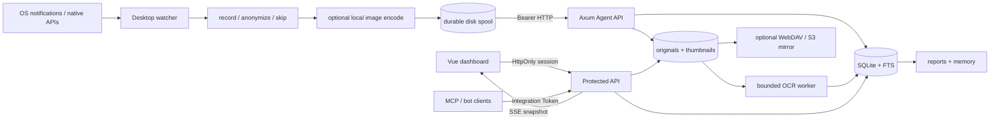
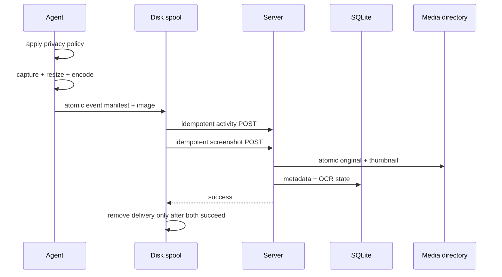

# Eyes on Me 架构与 Work Review 迁移评估

## 1. 项目与迁移结论

Eyes on Me 是多设备活动采集与服务端回顾系统：Rust Agent 采集前台应用、窗口/Tab、浏览器上下文和在场状态，Axum 服务端集中保存并统计，Vue 工作台提供概览、时间线、分析、日报、记忆和媒体治理。

参考仓库固定在 `/Users/wong/Code/RustLang/_Work_Review_latest`，对照提交为 `af95e9f`。原目录 `_Work_Review` 存在大量本地提交且与远端分叉，因此保留不动，避免强制更新破坏历史。

迁移原则是复用产品逻辑，不复制 Tauri 本地文件路径或前端直读 SQLite 的实现。截图、OCR、日报、记忆、隐私与删除全部改成受鉴权的多设备服务端契约。

## 2. 能力对照

| 能力 | 状态 | Eyes on Me 实现 |
| --- | --- | --- |
| 应用、窗口、Terminal/浏览器 Tab 时长 | 已完成 | 一级按应用聚合为完整矩形；点击进入窗口/Tab 二级时长与次数 |
| 原生轻量 macOS 采集 | 已完成 | NSWorkspace + AXObserver + Accessibility/CoreGraphics；无 AppleScript；5 秒低频补扫仅作兜底 |
| 24 小时、分类、逐日、非工作时段 | 已完成 | 服务端统一区间统计，连续区间按 120 秒裁剪 |
| 空闲、锁屏、全文搜索 | 已完成 | 原生状态采集；SQLite FTS 覆盖应用、标题、URL、域名和 OCR |
| 截图与缩略图 | 已完成 | Agent 本地 JPEG/PNG 编码；active/primary/all；服务端原图与独立缩略图 |
| OCR | 已完成 | 并发上限、感知哈希相似图复用、失败重试、可配置敏感行过滤、FTS 回填 |
| 隐私模式 | 已完成 | 应用/域名支持 record/anonymize/skip；旧 ignore 配置迁移为 anonymize |
| 离线可靠上传 | 已完成 | 事件与截图先写磁盘 spool；重启恢复；两者成功后才确认删除 |
| 媒体留存与删除 | 已完成 | 默认 7 天/2GB；启动后周期清理；截图删除与活动级联删除 |
| 日报与导出 | 已完成 | 确定性日报、可选 AI 润色、编辑、Markdown；活动 CSV/JSON 导出 |
| 语义记忆 | 已完成 | 可选 embeddings，失败或未配置时回退 SQLite FTS |
| Dashboard 鉴权 | 已完成 | HttpOnly + SameSite=Strict 会话；公网脚本强制长 Token |
| Agent 权限诊断 | 已完成 | 辅助功能、屏幕录制、截图策略、隐私规则和 spool 积压在 `/media` 展示 |
| 任意范围时间线 | 已完成 | 日期/RFC3339 范围、设备/应用/域名/分类/文本组合筛选、分页、截图/OCR 明细 |
| 细粒度删除 | 已完成 | 单条、日期、时间段、应用/域名/分类；事务清理 FTS/媒体并使日报和记忆失效 |
| 暂停/恢复采集 | 已完成 | 服务端期望/Agent 执行双状态；5 秒轻量控制、本地缓存、断网保持最后状态 |
| 自定义分类与历史回填 | 已完成 | 应用/域名规则按优先级查询时分类，保存后全部历史统计即时重算 |
| 多段工作时段 | 已完成 | ISO 星期 + 多个分钟区间，历史工作/非工作时间即时重算 |
| 工作片段与待办线索 | 已完成 | 按设备和间隔派生连续片段，从标题与 OCR 提取明确 TODO/FIXME/待办线索 |
| 日报偏好与范围导出 | 已完成 | 区块排序、置顶、隐藏/恢复、历史列表、范围 Markdown、原子自动导出 |
| 工具型 Assistant | 已完成 | 会话历史、自然语言日期、动态开场、NDJSON 分块、模板/AI/失败回退 |
| 配置备份与 fail-safe | 已完成 | Dashboard 设置备份/恢复；Agent 原子写、备份恢复、损坏配置 fail-safe `skip` |
| S3 / WebDAV | 已完成 | S3 SigV4/MinIO 与 WebDAV 镜像；HTTPS 边界、状态、周期/手动重试、删除同步 |
| MCP / 机器人接入边界 | 已完成 | 独立 Integration Token 的 JSON-RPC MCP 工具；机器人通过此边界接入 |
| Secret 边界 | 服务端等价实现 | Key 只从服务端环境注入，不下发浏览器、不写入 SQLite；单用户服务不复制桌面 Vault UI |

## 3. 当前架构



关键顺序是：隐私判断发生在 Agent；截图在事件首次进入传输链路时捕获并绑定事件 ID；事件与截图先持久化到本地；服务端验证事件归属和图片魔数后再保存；OCR 永远不阻塞上传响应。

## 4. 目录与责任

```text
client-desktop/src/
├── platform/                 # 原生窗口/Tab/在场状态；隐私规则决策
├── browser.rs                # 浏览器上下文规范化
├── screenshot.rs             # 显示器选择、缩放、JPEG/PNG 编码、权限检查
├── transport.rs              # 磁盘 spool、顺序上传、诊断上报
└── config.rs                 # 身份、Token、隐私、截图、spool 配置与迁移
client-server/src/
├── routes/api.rs             # 公共/Agent/Dashboard 路由边界
├── app_state.rs              # 快照、SSE、区间统计
├── db.rs                     # SQLite、FTS、媒体元数据、删除事务
├── media.rs                  # 原图/缩略图、OCR、留存、清理
├── reports.rs                # 日报
├── memory.rs                 # 记忆与 embeddings/FTS 回退
├── governance.rs             # 时间线、分类、工作时段、片段、批量删除
├── assistant.rs              # 会话、事实工具、模板与 AI 回退
├── remote.rs                 # WebDAV / S3 SigV4 镜像与重试
└── auth.rs                   # Dashboard 会话
web/src/
├── views/                    # 概览、设备、日报、助手、记忆、媒体、设置
├── components/               # 图表、矩形树图、下钻抽屉
├── api.ts                    # 认证 API 客户端
└── types.ts                  # Dashboard 契约
```

数据库只保存服务端对象键，不向浏览器暴露真实路径。Vue 不理解 SQLite 或媒体目录。Agent 不生成统计结论，服务端不尝试远程读取 Agent 本机文件。

SQLite 中参与排序和范围查询的时间统一为固定毫秒 UTC 文本，以保留普通索引效率；本地日期与工作时段在查询层按服务端时区换算。升级时由项目专用迁移表一次性规范旧 RFC3339 偏移格式，避免 `Z` 与 `+08:00` 直接按文本比较造成午夜附近漏记。

## 5. 媒体与删除一致性



截图删除会清理截图 FTS、元数据、原图和缩略图。活动删除会在同一数据库事务中清理活动搜索、截图搜索、截图记录和活动记录，再刷新 AppState 快照；文件删除是数据库提交后的幂等清理。周期任务按捕获时间删除过期截图，并从最旧项开始释放容量。

## 6. 安全和隐私边界

- 截图默认关闭，升级不会自动开始屏幕采集。
- `anonymize` 保留应用名与时间，移除 PID、标题、URL、域名并禁止截图。
- `skip` 不产生事件或截图；规则在数据离开设备前执行。
- Agent 写接口使用独立 Bearer Token；Dashboard 查询、SSE、媒体、删除、日报和记忆经过会话中间件。
- PNG/JPEG 必须通过魔数、解码、尺寸、像素数和请求体限制；对象键只由服务端生成。
- OCR 可配置敏感关键词，匹配行在数据库和 FTS 前替换为 `[redacted]`。
- 公网部署必须使用随机长 Token，并放在 VPN 或 HTTPS 反向代理后。

## 7. 取舍与剩余风险

1. 没有浏览器扩展时，URL 依赖 Accessibility。受限页面可能只有标题；5 秒补扫只能防事件丢失，不能突破浏览器权限边界。
2. 磁盘 spool 达到上限后使用背压而不是删除未发送数据。若网络长期中断且上游通道也被填满，Watcher 会明确记录丢弃日志；生产配置应监控 `/media` 中的积压并预留容量。
3. 文件系统、远程对象存储和 SQLite 无法形成单个 ACID 事务。实现采用原子写入、状态表、数据库事务和幂等删除；远程删除失败时保留本地引用。
4. SQLite 适合当前个人单实例。多租户或多个服务实例出现后，需引入用户/设备归属和 PostgreSQL。
5. 感知哈希用于避免近似静止画面重复 OCR，不表示语义等价；阈值保持保守，仍允许手动重试覆盖。

## 8. 配置索引

Agent JSON：`capture_filters.default_mode`、`app_rules`、`domain_rules`、`screenshots.format/max_width/jpeg_quality/display`、`spool.max_bytes`。控制缓存为 `client-desktop.control.json`，配置备份为 `client-desktop.config.json.bak`。

服务端环境变量：`EYES_ON_ME_MEDIA_*`、`EYES_ON_ME_OCR_*`、`EYES_ON_ME_AI_*`、`EYES_ON_ME_REMOTE_PROVIDER`、`EYES_ON_ME_WEBDAV_*`、`EYES_ON_ME_S3_*`、`EYES_ON_ME_REMOTE_PREFIX`、`EYES_ON_ME_INTEGRATION_TOKEN`。

## 9. 服务端化取代桌面实现的边界

- Tauri 的本机文件选择、系统托盘、桌面宠物和自动更新器不复制到服务端，它们不是活动回顾数据能力。
- 机器人不在主进程内各自常驻 Telegram/Feishu/DingTalk/WeCom SDK；统一使用带独立 Token 的 MCP 工具，减少四套数据库访问与重试实现。
- 单用户服务把 Secret Vault 替换为进程环境秘密：浏览器不能读取 Key。进入多用户后才需要租户级 Vault、资源授权和审计。
- OCR 积压超过单进程有界并发能力时再拆 Worker；当前状态、失败重试和幂等写入已保证可迁移。
