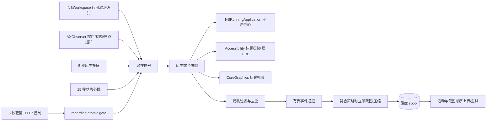
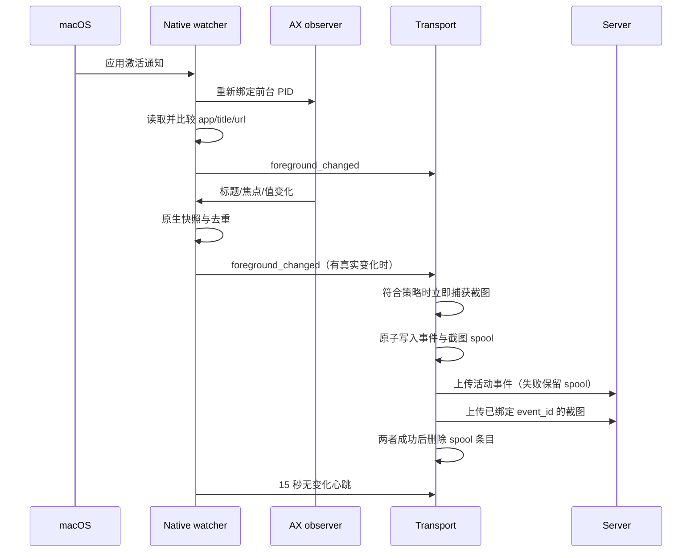

# macOS 原生轻量采集迁移

## 目标

macOS Agent 必须在应用、窗口、Terminal Tab 和浏览器 Tab 切换后尽快上报，同时保持低常驻开销。运行时采集路径不允许启动 `osascript`，也不依赖每秒执行外部命令。浏览器扩展不在本阶段范围内，因此浏览器和 Terminal 仍保留低频原生补扫。

## 组件与职责

- `NSWorkspace` 只负责应用进程切换，延迟取决于系统通知，不轮询。
- `AXObserver` 绑定当前前台进程，监听焦点窗口、主窗口、焦点控件、标题和值变化；收到通知只标记需要采样，实际读取集中在 watcher 线程，避免回调重入。
- Accessibility 快照读取当前窗口标题，并在浏览器的可访问性树中查找 URL。读取设置短超时和节点上限，防止异常应用拖住 watcher。
- CoreGraphics 从屏幕窗口列表按 PID 读取窗口标题，只在 AX 不可用或读取失败时兜底。它不提供浏览器 URL。
- 浏览器和 Terminal 每 5 秒执行一次上述原生快照，弥补应用未发 AX 通知或权限不足；普通应用只在事件和 15 秒心跳时读取。

## 状态与事件语义

`foreground_changed` 由应用 ID、PID、窗口标题、浏览器 URL 或页面标题变化产生。无变化的 AX 噪声会在 marker 比较处被丢弃。`activity_sample` 每 15 秒发送一次，用于在线状态和持续时长计算。

远程暂停/恢复不进入窗口检测路径。Transport 每 5 秒读取服务端期望状态并更新 `AtomicBool`；watcher 暂停时仅维持 `NSRunLoop`，不执行前台快照、截图或上报。状态和 revision 原子保存到 `client-desktop.control.json`，断网时保留最后状态，Agent 重启后先读取本地状态再请求服务端；恢复会强制一次当前前台采样。

## 降级顺序

1. Accessibility 已授权：AX 读取标题和 URL，AXObserver 提供窗口/Tab 事件。
2. Accessibility 未授权或单次读取失败：NSWorkspace 仍立即报告应用切换，CoreGraphics 尝试读取标题。
3. 事件丢失：浏览器/Terminal 5 秒原生补扫；其他应用由 15 秒心跳补扫。
4. 所有标题来源都失败：保留 NSRunningApplication 的应用信息，不复用已经属于其他进程的窗口信息。

## 截图一致性

Transport 在事件首次出队且确认符合截图策略时先捕获图片，在本地缩放并编码，再把事件清单与图片原子写入磁盘 spool。截图捕获成功后才更新时间冷却；上传重试和进程重启都复用同一份图片，不重新捕获。活动 POST 和截图 POST 都成功后才删除条目。

`active` 模式通过 CoreGraphics 窗口列表找到前台 PID 的窗口 ID，再调用系统截图工具的非交互窗口模式；`primary` 和 `all` 分别限制主显示器或全部显示器。截图命令不参与前台窗口/Tab 检测，不是高频轮询路径。

## 风险与约束

- 没有浏览器扩展时，浏览器 URL 依赖可访问性树。部分浏览器或隐私页面可能只提供标题，此时服务端仍能按标题统计 Tab，但 URL/域名可能为空。
- AX 通知不是所有第三方应用都完整实现，不能删除低频补扫。
- Accessibility 权限不应在后台 Agent 每次启动时强制弹窗；Agent 记录一次明确诊断，用户按需授权。
- 可访问性树遍历必须有深度、节点和时间预算，不进行无限递归。
- spool 默认上限 512MB；达到上限时使用明确日志和背压，不静默删除未发送的新数据。

## 实施顺序

1. 增加 macOS Accessibility 原生封装和有限树遍历。
2. 用 NSWorkspace + AXObserver 替换一秒 AppleScript 快照。
3. 将浏览器上下文改为接收原生 AX 页面信息，删除 macOS AppleScript 分支。
4. 调整 Transport 的截图时机、压缩、磁盘 spool 和冷却语义。
5. 上报 Accessibility/Screen Recording 权限、截图策略和 spool 积压诊断。
6. 覆盖 marker、降级、离线恢复和截图状态测试，并用 Chrome/Terminal 做真实切换验证。
