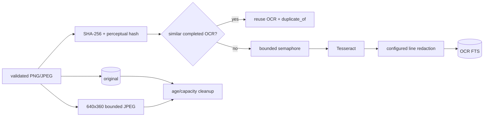

# 截图、日报、语义记忆与查看者鉴权实施规格

## 1. 已实现范围

本规格覆盖完整回顾闭环：Dashboard 会话鉴权；Agent 隐私与远程暂停；截图编码与可恢复上传；本地及 WebDAV/S3 媒体生命周期；任意范围时间线、工作片段与批量删除；分类和多段工作时段；结构化日报；语义记忆；带历史的工作助手；设置备份和 MCP 集成。截图与 AI 默认关闭。

## 2. Agent 契约

配置版本为 4：

```json
{
  "capture_filters": {
    "default_mode": "record",
    "app_rules": [{ "pattern": "1Password", "mode": "skip" }],
    "domain_rules": [{ "pattern": "bank.example", "mode": "anonymize" }]
  },
  "screenshots": {
    "enabled": false,
    "cooldown_secs": 30,
    "format": "jpeg",
    "max_width": 1920,
    "jpeg_quality": 78,
    "display": "active"
  },
  "spool": { "max_bytes": 536870912 }
}
```

- `record`：完整活动，可按策略截图。
- `anonymize`：保留应用名、时间和在场状态；移除 PID、窗口/Tab、URL、域名；禁止截图。
- `skip`：不发送活动或截图。
- 旧 `ignored_apps` / `ignored_domains` 自动迁移为 `anonymize`。

每条活动及其截图先保存到独立 spool 目录。`delivery.json` 保存可反序列化事件和图片 MIME/文件名；目录名包含可排序时间与事件 ID。上传使用事件 ID 幂等，活动和截图都成功后删除目录。spool 达到上限时背压，不删除未发送条目。

## 3. API 契约

```text
GET    /api/auth/session
POST   /api/auth/login
POST   /api/auth/logout

POST   /api/agent/activity
POST   /api/agent/status
POST   /api/agent/diagnostics
POST   /api/agent/screenshots/:eventId
GET    /api/agent/control/:deviceId
POST   /api/agent/control/:deviceId

GET    /api/timeline?date=&start=&end=&deviceId=&app=&domain=&category=&limit=&offset=
GET    /api/sessions?date=&deviceId=
POST   /api/activities/bulk-delete
PUT    /api/devices/:deviceId/recording

GET    /api/devices/:deviceId/screenshots?limit=100
GET    /api/screenshots?limit=100
GET    /api/screenshots/:screenshotId/content
GET    /api/screenshots/:screenshotId/thumbnail
DELETE /api/screenshots/:screenshotId
POST   /api/screenshots/:screenshotId/ocr
DELETE /api/activities/:eventId
GET    /api/media/status
GET    /api/media/remote
POST   /api/media/remote/retry
POST   /api/media/cleanup
GET    /api/agent/diagnostics
GET    /api/export/activities?format=csv|json&deviceId=...

GET    /api/reports/:date
POST   /api/reports/:date/generate?useAi=true|false
PUT    /api/reports/:date
GET    /api/reports/:date/export
GET    /api/reports?start=&end=
GET    /api/reports/export?start=&end=

GET    /api/memory?q=...&limit=...
POST   /api/memory/reindex

GET    /api/assistant/conversations
GET    /api/assistant/conversations/:id
DELETE /api/assistant/conversations/:id
GET    /api/assistant/prompts
POST   /api/assistant/stream

GET|PUT /api/settings/review
GET     /api/settings/review/export
POST    /api/settings/review/import
POST    /mcp
```

公共路由只包含健康检查、登录和 Agent 写入。统计、搜索、SSE、媒体读取/删除、诊断、日报、记忆和导出均经过 Dashboard Cookie 中间件。

截图上传只接受 PNG/JPEG。服务端验证 Bearer Token、事件存在、请求体、魔数、解码结果、宽高和总像素；客户端声明 MIME 必须与内容一致。对象键由服务端生成，Dashboard 只拿 API URL。

## 4. 数据表

```sql
CREATE TABLE screenshots (
  id TEXT PRIMARY KEY,
  event_id TEXT NOT NULL UNIQUE,
  device_id TEXT NOT NULL,
  captured_at TEXT NOT NULL,
  mime_type TEXT NOT NULL,
  byte_size INTEGER NOT NULL,
  width INTEGER,
  height INTEGER,
  sha256 TEXT NOT NULL,
  storage_key TEXT NOT NULL UNIQUE,
  thumbnail_storage_key TEXT,
  visual_hash TEXT,
  ocr_status TEXT NOT NULL,
  ocr_text TEXT,
  ocr_error TEXT,
  ocr_attempts INTEGER NOT NULL DEFAULT 0,
  ocr_attempted_at TEXT,
  duplicate_of TEXT,
  created_at TEXT NOT NULL
);
```

`screenshot_search_fts` 索引最终 OCR；`agent_diagnostics` 按设备保存最新权限/策略/积压/控制 revision。`device_recording_control` 保存期望与 Agent 已执行状态；`category_rules`、`work_schedule_segments`、`review_settings` 保存历史即时生效的回顾规则。`daily_reports` 保存 Markdown 和生成元数据；`memory_entries` 及 FTS 保存活动、OCR 和日报记忆；`assistant_conversations/messages` 保存会话；`screenshot_remote_mirror` 保存远程镜像状态。

所有参与排序或范围查询的时间字段使用固定三位毫秒 UTC 文本，因而可以继续使用普通 SQLite 索引。`eyes_on_me_schema_migrations` 记录一次性数据迁移；版本 1 会在事务内规范化旧记录里的 `Z`、显式时区偏移和不定长小数，修复本地日边界附近按字符串比较漏数的问题。日期归属、日报边界和工作时段仍使用服务端本地时区。

## 5. 媒体处理



默认：单文件 8MB、50M 像素、保留 7 天、总原图容量 2GB、OCR 并发 1。周期清理按捕获时间处理过期项；超容量时从最旧截图开始。缩略图大小独立计入状态，但容量决策以原图为主。

升级前已存在且没有缩略图键的截图采用按需迁移：第一次请求缩略图时读取原图、生成 JPEG、原子保存并回填元数据，不阻塞启动，也不批量重写历史媒体。

OCR 失败保留截图并记录错误；Dashboard 可重试，尝试次数递增。感知哈希只在同设备最近已完成 OCR 的截图中匹配，汉明距离阈值为 8。`EYES_ON_ME_OCR_REDACT_TERMS` 以逗号分隔，匹配行在写库前替换。

## 6. 删除语义

- 删除截图：删除截图 FTS 与元数据，再幂等删除原图/缩略图；活动保留。
- 删除活动：事务内删除截图 FTS、截图元数据、活动搜索和活动记录；事务后删除文件并重载 AppState/SSE 快照。
- 日期、时间段、应用、域名或分类批量删除使用同一事务，并使受影响日期的日报与语义记忆失效。
- 已镜像的截图先从 WebDAV/S3 删除；远程凭据缺失或远端删除失败时拒绝丢弃本地引用，避免生成不可治理的远程孤儿。
- 删除不存在资源返回 404；重复上传同一事件返回既有截图记录。
- 文件系统与 SQLite 不能共享事务，所以写入使用临时文件 + rename，删除允许重复执行。

## 7. 日报与记忆

日报基础内容只依赖服务端统计与 OCR，可追溯且不需要模型。区块支持排序、置顶、隐藏/恢复；日期范围可合并导出，保存或生成后可原子自动导出。配置 AI 后只对已有 Markdown 润色，失败时保存确定性版本和原因。API Key 仅来自服务端环境变量。

记忆重建把活动、OCR、日报转成稳定 memory key；内容未变化时保留 embedding。查询优先语义相似度，未配置 embedding 或调用失败时回退 SQLite FTS，再回退最近记录。

工作助手先解析“今天、昨天、最近一周、最近三小时或 YYYY-MM-DD”等范围，再从活动、网站、当前上下文、工作片段和待办线索构造事实输入。未配置模型时返回确定性模板；AI 增强失败会回退模板。响应采用 NDJSON 分块，历史会话保存在服务端。

## 8. 安全约束

- 截图默认关闭；隐私规则在设备端先执行。
- 公网脚本要求 Agent/Dashboard Token 均至少 24 字符。
- Dashboard Cookie 为 HttpOnly、SameSite=Strict；HTTPS 使用 Secure。
- 所有媒体 URL 都需 Dashboard 会话，不暴露存储目录。
- 导出文件名由服务端固定生成，不接受文件路径参数。
- 当前是个人单实例，不声称具备多租户资源隔离；公网仍应置于 VPN 或 HTTPS 反向代理后。
- MCP 使用独立 `EYES_ON_ME_INTEGRATION_TOKEN`，默认关闭；机器人和自动化程序只能通过工具契约访问，不直读数据库。
- WebDAV/S3 凭据只来自服务端环境变量。公网明文 HTTP 远程端点被拒绝，本机和私网 NAS 例外。
